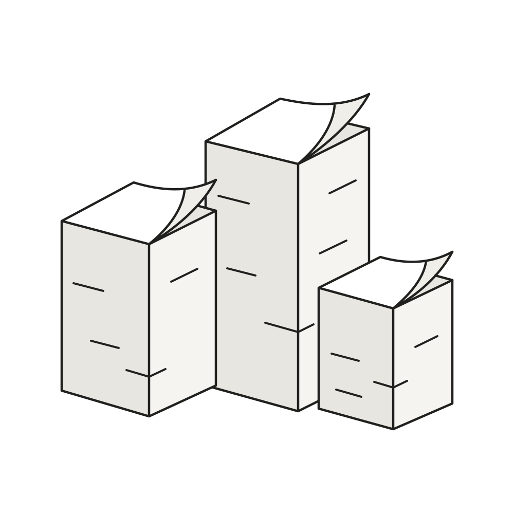
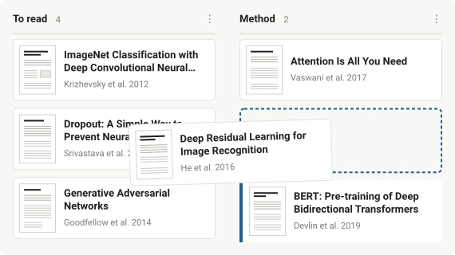

<p align="center">
  </img>
</p>

<div align="center">
<h3 max-width='200px' align="center">PaperStack</h3>
  <p><i>A desktop workspace for scholarly PDFs<br/>
  Organise into projects, read, annotate, extract bibliographies<br/>
  Built with Tauri and Rust</i><br/></p>
  <p>
    
    
  </p>
  <p><a href="https://antonio-leitao.github.io/paperstack/"><b>antonio-leitao.github.io/paperstack</b></a></p>
</div>

#

PaperStack keeps a library of papers on your own machine and lets you arrange
them the way you actually think about them — into projects, into columns, into
piles you can name. Open one and it renders immediately. In the background it
pulls the bibliography apart, resolves each reference against scholarly metadata
providers, and links in-text citations to their entries, so hovering a `[12]`
shows you what it is and where to get it.

Everything is local: your PDFs, your highlights, your notes and the reference
database all live in a single folder on your machine.

<p align="center">
  
</p>

### Contents

- [Install](#install)
  - [Build from source](#build-from-source)
- [The citation service](#the-citation-service)
- [Provider keys](#provider-keys)
- [How it works](#how-it-works)
- [Limitations](#limitations)

## Install

Download the latest `.dmg` from
[Releases](https://github.com/Antonio-Leitao/paperstack/releases/latest) and drag
PaperStack into Applications. It is a universal build — Apple Silicon and Intel.

**The app is not code-signed**, so macOS will refuse it the first time with
_"PaperStack is damaged and can't be opened."_ It is not damaged; that is simply
what Gatekeeper says about an app from a developer who has not paid Apple's
$99/year. To open it:

1. Move PaperStack to Applications and double-click it once — let it fail.
2. Open **System Settings → Privacy & Security**, scroll to Security.
3. Next to the message about PaperStack, click **Open Anyway**.

You only do this once.

If you would rather not run an unsigned binary from a stranger, don't — build it
yourself instead. It is the same code and takes about three minutes.

### Build from source

Requires [Node](https://nodejs.org), [Rust](https://rustup.rs) and the Xcode
command line tools.

```sh
git clone https://github.com/Antonio-Leitao/paperstack.git
cd paperstack
npm install
npm run install:local
```

That builds a release binary and installs it straight into `/Applications`. Use
`npm run tauri dev` instead if you want a development build with hot reload.

## The citation service

Pulling a bibliography out of a PDF is done by [GROBID](https://github.com/kermitt2/grobid),
which PaperStack does not bundle. You have two options, and the difference
matters for privacy.

**Run it locally** — private, faster, and the recommended setup. Requires Docker:

```sh
docker compose up -d
```

The first start downloads a ~500 MB image. Wait until it answers before opening
a PDF:

```sh
curl http://127.0.0.1:8070/api/isalive
```

**Or let it fall back.** If nothing is listening on `127.0.0.1:8070`, PaperStack
uses the public hosted GROBID service instead — which means **your PDF is
uploaded to a third-party server**. That is fine for published papers and a bad
idea for anything unpublished or confidential. Availability and quotas there are
outside our control.

PaperStack checks the local service first, every time, and never contacts the
hosted one while a local instance is healthy.

## Provider keys

References are resolved against Crossref, OpenAlex, Semantic Scholar and arXiv.
All of them work anonymously, so PaperStack needs no configuration to run.

Keys only buy you higher, more predictable rate limits, and are worth adding if
you analyse a lot of papers at once:

| Setting              | Get one from                                                        | Effect                                 |
| -------------------- | ------------------------------------------------------------------- | -------------------------------------- |
| OpenAlex key         | [OpenAlex settings](https://openalex.org/settings/api)              | Avoids the shared anonymous pool       |
| Semantic Scholar key | [Semantic Scholar API](https://www.semanticscholar.org/product/api) | Higher rate limit                      |
| Crossref email       | —                                                                   | Enters Crossref's faster "polite pool" |

Add them in **Settings** (the gear, top right). They are stored in your
application data folder, readable only by you, and never leave your machine
except as request headers to the provider they belong to.

## How it works

- **Extraction.** GROBID returns the bibliography plus coordinates for every
  reference and every in-text citation, which is what makes citation hovering
  possible.
- **Resolution.** Each reference is matched against Crossref first, then
  OpenAlex, then arXiv, then Semantic Scholar — stopping as soon as one is
  confident. Ambiguous matches keep the original extracted metadata rather than
  guessing.
- **Sharing.** Resolved references are stored once and shared across papers, so
  a reference cited by five of your PDFs is looked up once and improves for all
  five when a better record is found.
- **Caching.** Results are keyed by the PDF's SHA-256, so re-importing the same
  paper costs nothing, and improving the matcher re-runs matching without
  re-uploading anything.

Your library lives in `~/Library/Application Support/com.antonio.paperstack/` —
the PDFs, their thumbnails, and a single `paperstack.sqlite3` holding projects,
notes, highlights and the reference database.

## Limitations

- macOS only for now. Nothing in the codebase is macOS-specific beyond the
  packaging, but no other platform has been built or tested.
- Citation overlays assume unrotated pages.
- Hosted GROBID availability and quotas are controlled by a third party. Running
  the local container avoids both that and the upload.

## License

MIT. The mark and icons are part of this repository and covered by the same
license; see [`design_system/`](design_system/) for how they are built.
